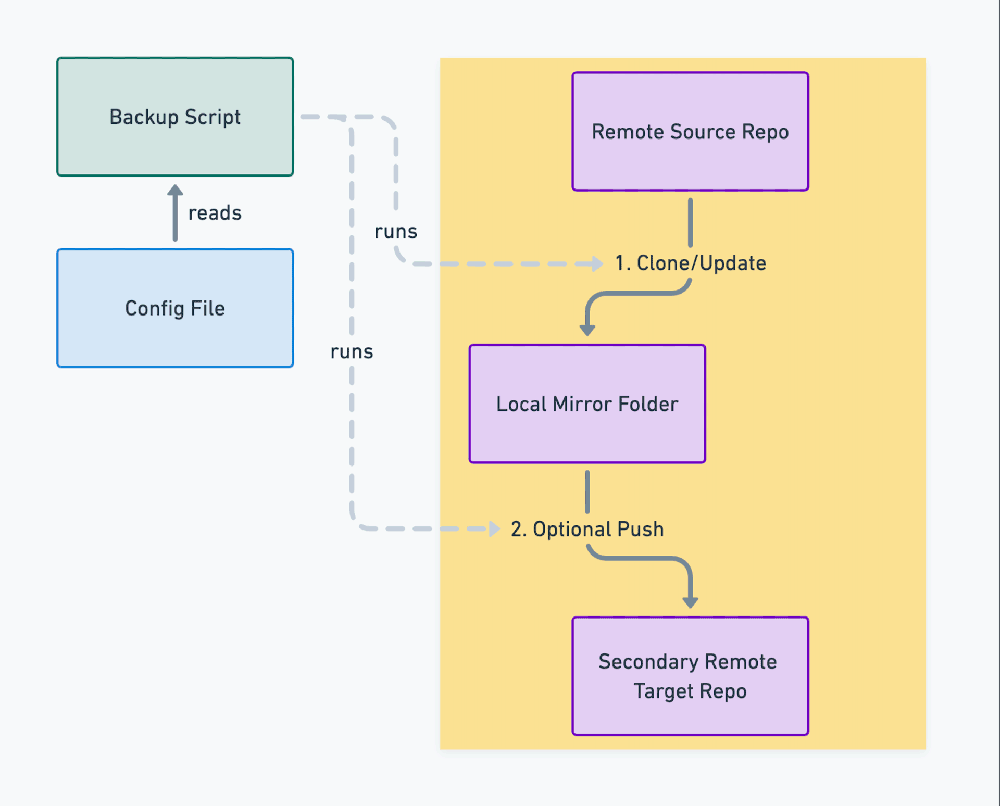

# Git-Backup.sh 🚀

Welcome to **Git-Backup.sh**! This simple shell-based utility is your go-to for creating local and remote backups of your git repositories.

## Why Git-Backup.sh? 🤔

It does one thing, and one thing well: create local and remote backups of git repositories. With just bash (or zsh), git, and sed, you're equipped to backup your repositories without diving into complex setups.



## Features 🌟

- **Local Mirroring**: Clones or updates a local mirrors of all your repositories.
- **Remote Backups**: Optionally, push local mirrors to secondary remote locations.
- **Zero Dependencies**: No need for anything beyond bash or zsh, git, and sed.
- **Easy Configuration**: A simple config file is all you need to manage your backup preferences.
- **Universally Compatible**: Runs wherever bash is found, be it macOS, Linux, or WSL on Windows.

## Getting Started

### Prerequisites

You should have `git`, `bash`, and `sed` installed on your system.

### Installation

1. Clone the Git-Backup.sh repository to your machine:
   ```bash
   git clone https://github.com/manuelkiessling/git-backup.sh.git
   ```
2. Change to the cloned directory:
   ```bash
   cd git-backup.sh
   ```
3. Make the script executable:
   ```bash
   chmod +x backup.sh
   ```

### Configuration

1. In the root of the cloned directory, create a `repositories.conf` file. See [repositories.conf.example](repositories.conf.example) for an example configuration file.

2. Format your repository configurations as shown:
   ```
   <source repo url>[ <label>:<target repo url>]
   ```
   Example, showcasing both SSH and HTTPS URLs:
   ```
   # SSH URL example
   git@github.com:foo/bar.git bitbucket:git@bitbucket.org:foo/bar.git
   
   # HTTPS URL example
   https://username@bitbucket.org/foo/bar.git github:git@github.com:foo/bar.git
   ```

### Usage

Run the script to backup your repositories as configured:
```bash
./backup.sh
```

## Contributing 🤝

We welcome contributions! Feel free to help make Git-Backup.sh even more awesome.

1. Fork the Project
2. Create your Feature Branch (`git checkout -b feature/CoolFeature`)
3. Commit your Changes (`git commit -m 'Add some CoolFeature'`)
4. Push to the Branch (`git push origin feature/CoolFeature`)
5. Open a Pull Request

## License 📜

This project is under the MIT License. See [LICENSE.txt](LICENSE.txt) for more.

---

Here's to never losing a line of code again! 🚀🔐
